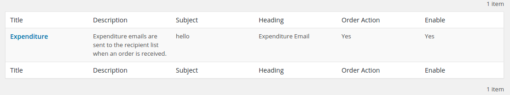
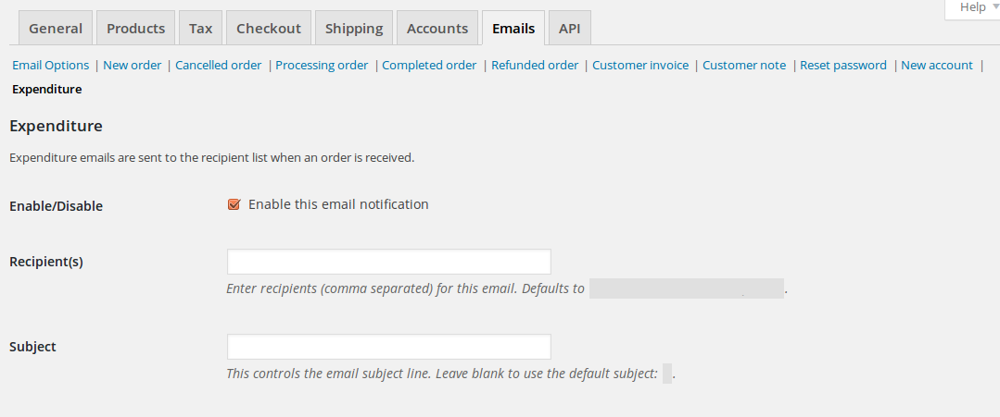

<!-- DO NOT EDIT THIS FILE; it is auto-generated from readme.txt -->
# Woo Custom Emails

Woo Custom Emails is a plugin that helps you create custom emails for your WooCommerce Order.

**Contributors:** [wp3sixty](https://profiles.wordpress.org/wp3sixty), [mehulkaklotar](https://profiles.wordpress.org/mehulkaklotar), [utkarshpatel](https://profiles.wordpress.org/utkarshpatel), [dipesh.kakadiya](https://profiles.wordpress.org/dipesh.kakadiya), [faishal](https://profiles.wordpress.org/faishal)  
**Tags:** [woo custom emails](https://wordpress.org/plugins/tags/woo custom emails), [woocommerce custom emails](https://wordpress.org/plugins/tags/woocommerce custom emails), [woocommerce](https://wordpress.org/plugins/tags/woocommerce), [email](https://wordpress.org/plugins/tags/email), [order](https://wordpress.org/plugins/tags/order), [ecommerce](https://wordpress.org/plugins/tags/ecommerce), [custom email template](https://wordpress.org/plugins/tags/custom email template)  
**Requires at least:** 4.9  
**Tested up to:** 4.9.5  
**Stable tag:** 2.2  
**License:** [GPLv2 or later](http://www.gnu.org/licenses/gpl-2.0.html)  

## Description ##

Create your custom WooCommerce order emails with WooCommerce default email settings functionality.
### Translation ###
If you want to translate the plugin strings in to your language then you can go here -> https://translate.wordpress.org/projects/wp-plugins/woo-custom-emails

### Contributing to Woo Custom Emails ###
If you have a patch, or stumbled upon an issue with Woo Custom Emails core, you can contribute this back to the code. Submit your pull request or issue on [Github WooCustomEmails](https://github.com/mehulkaklotar/woo-custom-emails)

## Installation ##

### From your WordPress dashboard ###
1. Visit 'Plugins > Add New'
2. Search for 'Woo Custom Emails'
3. Activate Woo Custom Emails from your Plugins page.
4. Go to WordPress Settings menu -> Woo Custom Emails.

### From WordPress.org ###
1. Download Woo Custom Emails.
2. Upload the 'woo-custom-emails' directory to your '/wp-content/plugins/' directory, using your favorite method (ftp, sftp, scp, etc...)
3. Activate Woo Custom Emails from your Plugins page.
4. Go to WordPress Settings menu -> Woo Custom Emails.

## Screenshots ##

### Add/Edit custom emails

### View custom emails list

### WooCommerce email settings

### WooCommerce Order action with custom email

## Changelog ##

### 2.2 ###
* Translation changes
* Fixed errors

### 2.1 ###
* WC 3.2.6 update changes
* Fixed errors

### 2.0.7 ###
* WC 3.0 update changes
* Menu change
* Fixed errors

### 2.0.6 ###
* BCC emails sending hotfix

### 2.0.5 ###
* Find and replace placeholder filters added

### 2.0.4 ###
* Custom order status support
* PHPDoc change

### 2.0.3 ###
* Recipients added to bcc headers if send to customer only

### 2.0.2 ###
* Hotfix

### 2.0.1 ###
* Send to customer only settings
* WP List table WordPress < 4.3 compatibility support

### 2.0 ###
* WP List table added for email listing
* Recipients support
* WooCommerce order statuses select and fire emails when they change

### 1.2.1 ###
* Hotfix

### 1.2 ###
* Email subject field
* Description with textarea field

### 1.1 ###
* Unique id generation for email classes
* Assets added

### 1.0 ###
* Initial release
* Custom WooCommerce order emails
* WP Editor for email template

